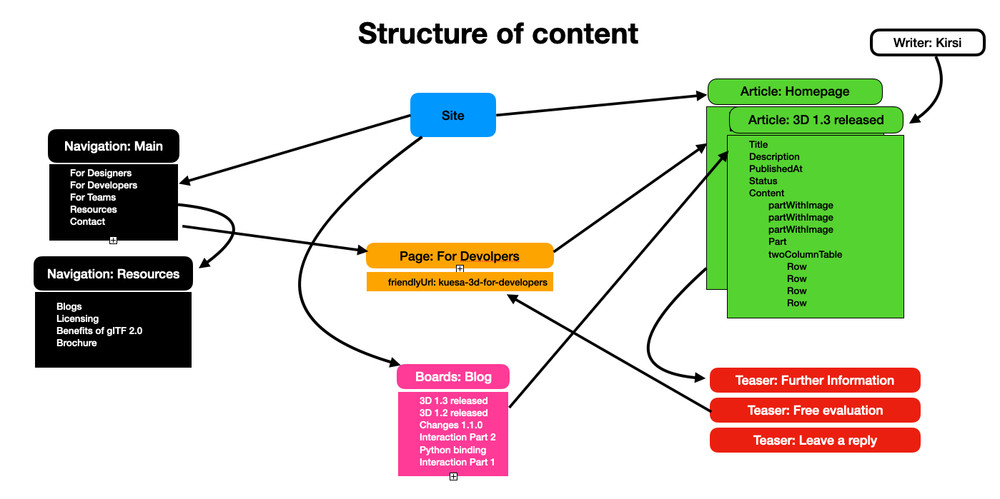
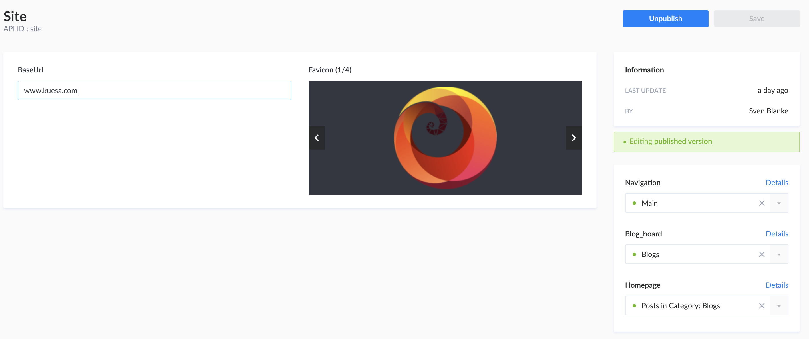
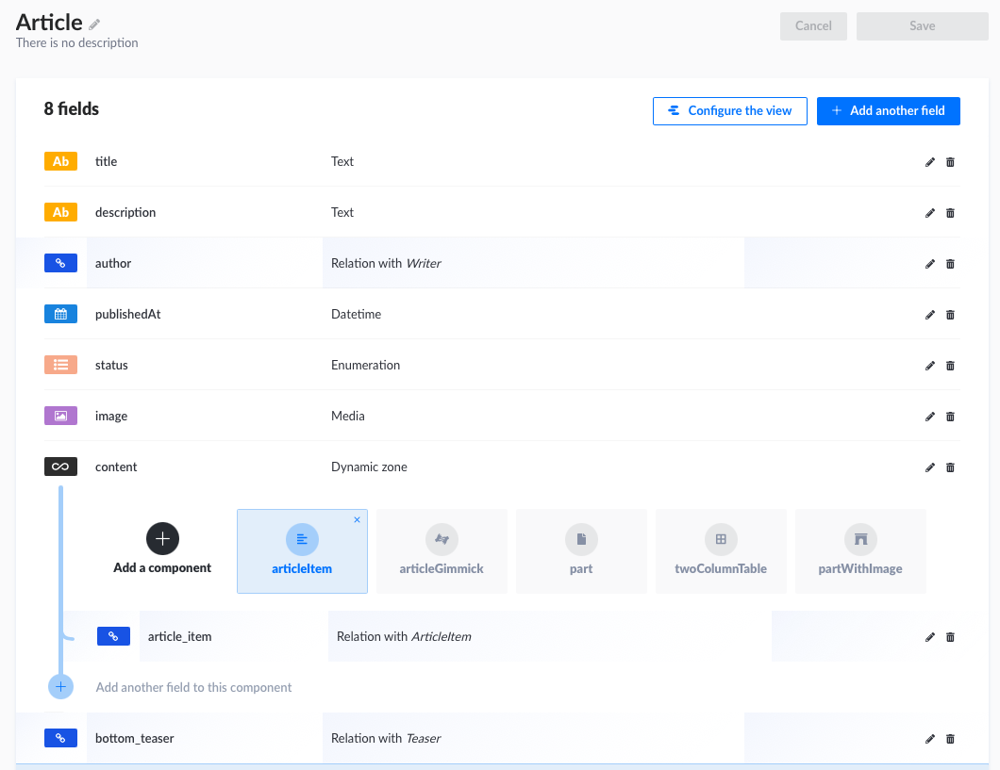
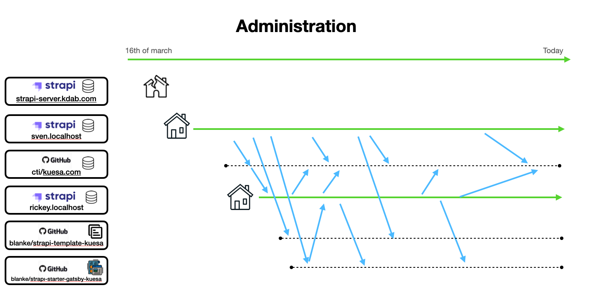

# strapi-template-kuesa

Strapi template to create Strapi projects pre-configured for the kuesa site



## Usage

```bash
# Using Yarn
yarn create strapi-app my-app-name --template https://github.com/blanke/strapi-template-kuesa

# Or using NPM
npx create-strapi-app my-app-name --template https://github.com/blanke/strapi-template-kuesa
```

## Features

- 2 Content types: Article, ArticleItem
    - 4 building blocks
      - articleItem (reusable parts for article, can be used in other articles)
      - articleGimmick (e.g. ContactFormular, BlogOverview, LeaveAReply)
      - part (free format markdown part)
      - twoColumnTable (maybe useful, maybe better to take only partWithImage)
      - partWithImage (A text picture combination, with suggestions to place to picture)
- 9 Created articles (Pages and Blog Entries)
- 2 Menus (Primary, Secondary)
- 1 Board (for the Blog-Gimmick)
- Pages (to create the friendlyUrl)

## How to organize a site?



## How to organize an article?



Beside the fixed fields to describe the general subject of the article and an optional teaser at the bottom, the article should be an array of one of the following components:
- part a free format piece of text. If there are images inserted, they will be positioned under the previous and above the following text
- partItem the same, but defined in a separate component
- partWithImage text, where the image can be positioned seamless to the text
- twoColumnTable a table with two columns
- pageGimmick one of Blog, Comment, Formular


## Starters

This template is used by the following starters:

* [strapi-starter-gatsby-kuesa](https://github.com/blanke/strapi-starter-gatsby-blog)
* [strapi-starter-scully-kuesa](https://github.com/blanke/strapi-starter-scully-blog)


## Adminstration



    